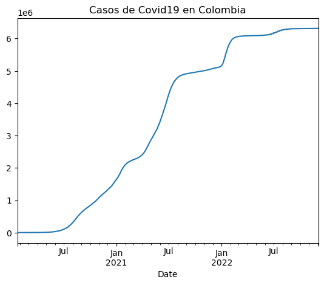
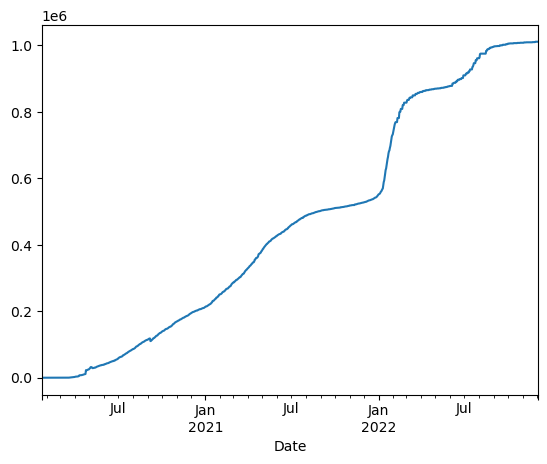
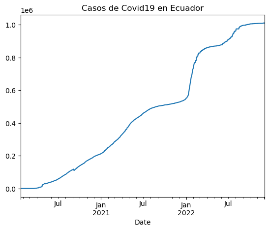
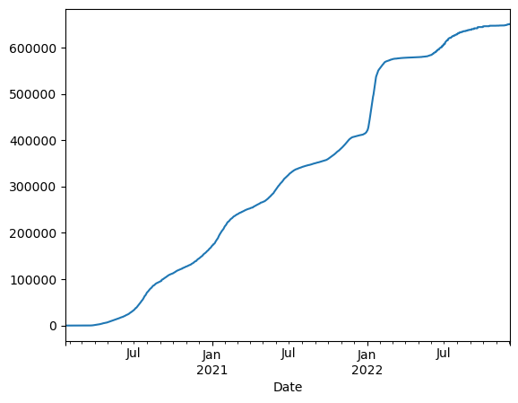
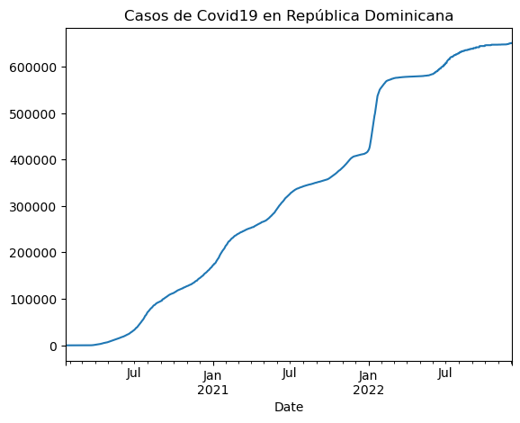
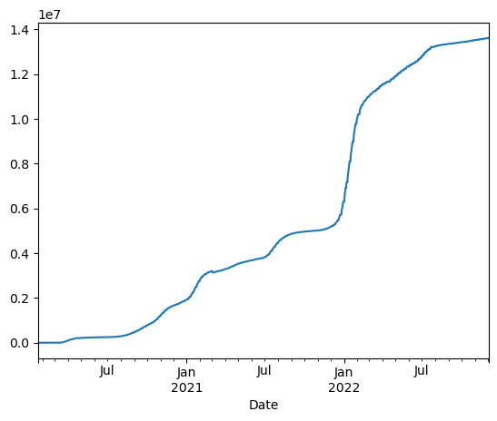
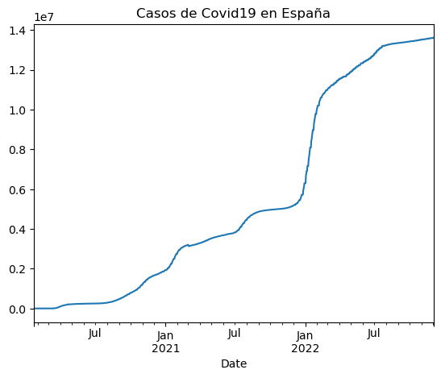

# Actividad 4: Uso de Pandas

Para realizar la Actividad Dirigida 4 utilizaremos "Pandas", la librería de Python. En este caso continuaremos con el ejercicio en clase y trabajaremos con los datos de Covid-19 de Ecuador, República Dominicana y España.

La URL: https://api.covid19api.com/countries

[El link para ver la actividad en Jupyter está acá](http://localhost:8888/notebooks/cuadernos-master/ad4.ipynb#)

## Instalación de librerías:

Para instalar la librería instalaremos la función "!pip". La exclamación es necesaria porque no estamos ejecutando Python, sino bash.


```python
!pip install pandas
```

    Requirement already satisfied: pandas in c:\users\windows\anaconda3\lib\site-packages (1.4.4)
    Requirement already satisfied: pytz>=2020.1 in c:\users\windows\anaconda3\lib\site-packages (from pandas) (2022.1)
    Requirement already satisfied: numpy>=1.18.5 in c:\users\windows\anaconda3\lib\site-packages (from pandas) (1.21.5)
    Requirement already satisfied: python-dateutil>=2.8.1 in c:\users\windows\anaconda3\lib\site-packages (from pandas) (2.8.2)
    Requirement already satisfied: six>=1.5 in c:\users\windows\anaconda3\lib\site-packages (from python-dateutil>=2.8.1->pandas) (1.16.0)
    

## Configuración de Pandas

Para importar utilizaremos la convención "pd" como abrebiatura para llamar a la librería.


```python
import pandas as pd
```

## Crear variable

Las variables se asignan con el símbolo "=" y los escribimos entrecomillados por ser una cadena de caracteres.


```python
url = "https://api.covid19api.com/countries"
```


```python
url
```


    'https://api.covid19api.com/countries'


## Crear dataframe

La abreviatura que se emplea para los dataframe es "df". Existe una función "read_json()" que lo que hace es leer el formato "json". Dentro del paréntesis indicaremos el valor de lo que queremos que lea, en este caso la url.


```python
df = pd.read_json(url)
```

Para visualizar los datos llamamos al objeto. Observamos una tabla que contiene tres columnas y una columna de control de Pandas, que identifica cada una de las entradas del dataframe.


```python
df
```


<div>
<style scoped>
    .dataframe tbody tr th:only-of-type {
        vertical-align: middle;
    }

    .dataframe tbody tr th {
        vertical-align: top;
    }

    .dataframe thead th {
        text-align: right;
    }
</style>
<table border="1" class="dataframe">
  <thead>
    <tr style="text-align: right;">
      <th></th>
      <th>Country</th>
      <th>Slug</th>
      <th>ISO2</th>
    </tr>
  </thead>
  <tbody>
    <tr>
      <th>0</th>
      <td>Ecuador</td>
      <td>ecuador</td>
      <td>EC</td>
    </tr>
    <tr>
      <th>1</th>
      <td>French Polynesia</td>
      <td>french-polynesia</td>
      <td>PF</td>
    </tr>
    <tr>
      <th>2</th>
      <td>Greenland</td>
      <td>greenland</td>
      <td>GL</td>
    </tr>
    <tr>
      <th>3</th>
      <td>Honduras</td>
      <td>honduras</td>
      <td>HN</td>
    </tr>
    <tr>
      <th>4</th>
      <td>Martinique</td>
      <td>martinique</td>
      <td>MQ</td>
    </tr>
    <tr>
      <th>...</th>
      <td>...</td>
      <td>...</td>
      <td>...</td>
    </tr>
    <tr>
      <th>243</th>
      <td>Côte d'Ivoire</td>
      <td>cote-divoire</td>
      <td>CI</td>
    </tr>
    <tr>
      <th>244</th>
      <td>Eritrea</td>
      <td>eritrea</td>
      <td>ER</td>
    </tr>
    <tr>
      <th>245</th>
      <td>Faroe Islands</td>
      <td>faroe-islands</td>
      <td>FO</td>
    </tr>
    <tr>
      <th>246</th>
      <td>Niger</td>
      <td>niger</td>
      <td>NE</td>
    </tr>
    <tr>
      <th>247</th>
      <td>Singapore</td>
      <td>singapore</td>
      <td>SG</td>
    </tr>
  </tbody>
</table>
<p>248 rows × 3 columns</p>
</div>


## Exploración de la tabla

Para ver las primeras entradas de la tabla utilizamos la siguiente función. Como metemos el número 6 veremos las seis primeras observaciones.


```python
df.head(6)
```


<div>
<style scoped>
    .dataframe tbody tr th:only-of-type {
        vertical-align: middle;
    }

    .dataframe tbody tr th {
        vertical-align: top;
    }

    .dataframe thead th {
        text-align: right;
    }
</style>
<table border="1" class="dataframe">
  <thead>
    <tr style="text-align: right;">
      <th></th>
      <th>Country</th>
      <th>Slug</th>
      <th>ISO2</th>
    </tr>
  </thead>
  <tbody>
    <tr>
      <th>0</th>
      <td>Ecuador</td>
      <td>ecuador</td>
      <td>EC</td>
    </tr>
    <tr>
      <th>1</th>
      <td>French Polynesia</td>
      <td>french-polynesia</td>
      <td>PF</td>
    </tr>
    <tr>
      <th>2</th>
      <td>Greenland</td>
      <td>greenland</td>
      <td>GL</td>
    </tr>
    <tr>
      <th>3</th>
      <td>Honduras</td>
      <td>honduras</td>
      <td>HN</td>
    </tr>
    <tr>
      <th>4</th>
      <td>Martinique</td>
      <td>martinique</td>
      <td>MQ</td>
    </tr>
    <tr>
      <th>5</th>
      <td>Netherlands Antilles</td>
      <td>netherlands-antilles</td>
      <td>AN</td>
    </tr>
  </tbody>
</table>
</div>


Para ver las 6 últimas entradas:


```python
df.tail(6)
```


<div>
<style scoped>
    .dataframe tbody tr th:only-of-type {
        vertical-align: middle;
    }

    .dataframe tbody tr th {
        vertical-align: top;
    }

    .dataframe thead th {
        text-align: right;
    }
</style>
<table border="1" class="dataframe">
  <thead>
    <tr style="text-align: right;">
      <th></th>
      <th>Country</th>
      <th>Slug</th>
      <th>ISO2</th>
    </tr>
  </thead>
  <tbody>
    <tr>
      <th>242</th>
      <td>Angola</td>
      <td>angola</td>
      <td>AO</td>
    </tr>
    <tr>
      <th>243</th>
      <td>Côte d'Ivoire</td>
      <td>cote-divoire</td>
      <td>CI</td>
    </tr>
    <tr>
      <th>244</th>
      <td>Eritrea</td>
      <td>eritrea</td>
      <td>ER</td>
    </tr>
    <tr>
      <th>245</th>
      <td>Faroe Islands</td>
      <td>faroe-islands</td>
      <td>FO</td>
    </tr>
    <tr>
      <th>246</th>
      <td>Niger</td>
      <td>niger</td>
      <td>NE</td>
    </tr>
    <tr>
      <th>247</th>
      <td>Singapore</td>
      <td>singapore</td>
      <td>SG</td>
    </tr>
  </tbody>
</table>
</div>


Para ver la información sobre las variables que contiene el dataframe utilizamos la siguiente función.


```python
df.info()
```

    <class 'pandas.core.frame.DataFrame'>
    RangeIndex: 248 entries, 0 to 247
    Data columns (total 3 columns):
     #   Column   Non-Null Count  Dtype 
    ---  ------   --------------  ----- 
     0   Country  248 non-null    object
     1   Slug     248 non-null    object
     2   ISO2     248 non-null    object
    dtypes: object(3)
    memory usage: 5.9+ KB
    

Para visualizar solo una de las variables:


```python
df['Country']
```


    0               Ecuador
    1      French Polynesia
    2             Greenland
    3              Honduras
    4            Martinique
                 ...       
    243       Côte d'Ivoire
    244             Eritrea
    245       Faroe Islands
    246               Niger
    247           Singapore
    Name: Country, Length: 248, dtype: object


Para visualizar un valor concreto de una de las variables:


```python
df['Country'][66]
```


    'Saint Helena'


## Tiempo real

La url que utilizaremos ahora es la siguiente https://api.covid19api.com/country/colombia/status/confirmed/live

Guardaremos los datos de la misma manera que lo hicimos anteriormente, pero añadiendo "df_col" (abreviatura de Colombia para identificar que este dataframe es de este país concreto.


```python
url_col = 'https://api.covid19api.com/country/colombia/status/confirmed/live'
df_col = pd.read_json(url_col)
df_col
```


<div>
<style scoped>
    .dataframe tbody tr th:only-of-type {
        vertical-align: middle;
    }

    .dataframe tbody tr th {
        vertical-align: top;
    }

    .dataframe thead th {
        text-align: right;
    }
</style>
<table border="1" class="dataframe">
  <thead>
    <tr style="text-align: right;">
      <th></th>
      <th>Country</th>
      <th>CountryCode</th>
      <th>Province</th>
      <th>City</th>
      <th>CityCode</th>
      <th>Lat</th>
      <th>Lon</th>
      <th>Cases</th>
      <th>Status</th>
      <th>Date</th>
    </tr>
  </thead>
  <tbody>
    <tr>
      <th>0</th>
      <td>Colombia</td>
      <td>CO</td>
      <td></td>
      <td></td>
      <td></td>
      <td>4.57</td>
      <td>-74.3</td>
      <td>0</td>
      <td>confirmed</td>
      <td>2020-01-22 00:00:00+00:00</td>
    </tr>
    <tr>
      <th>1</th>
      <td>Colombia</td>
      <td>CO</td>
      <td></td>
      <td></td>
      <td></td>
      <td>4.57</td>
      <td>-74.3</td>
      <td>0</td>
      <td>confirmed</td>
      <td>2020-01-23 00:00:00+00:00</td>
    </tr>
    <tr>
      <th>2</th>
      <td>Colombia</td>
      <td>CO</td>
      <td></td>
      <td></td>
      <td></td>
      <td>4.57</td>
      <td>-74.3</td>
      <td>0</td>
      <td>confirmed</td>
      <td>2020-01-24 00:00:00+00:00</td>
    </tr>
    <tr>
      <th>3</th>
      <td>Colombia</td>
      <td>CO</td>
      <td></td>
      <td></td>
      <td></td>
      <td>4.57</td>
      <td>-74.3</td>
      <td>0</td>
      <td>confirmed</td>
      <td>2020-01-25 00:00:00+00:00</td>
    </tr>
    <tr>
      <th>4</th>
      <td>Colombia</td>
      <td>CO</td>
      <td></td>
      <td></td>
      <td></td>
      <td>4.57</td>
      <td>-74.3</td>
      <td>0</td>
      <td>confirmed</td>
      <td>2020-01-26 00:00:00+00:00</td>
    </tr>
    <tr>
      <th>...</th>
      <td>...</td>
      <td>...</td>
      <td>...</td>
      <td>...</td>
      <td>...</td>
      <td>...</td>
      <td>...</td>
      <td>...</td>
      <td>...</td>
      <td>...</td>
    </tr>
    <tr>
      <th>1042</th>
      <td>Colombia</td>
      <td>CO</td>
      <td></td>
      <td></td>
      <td></td>
      <td>4.57</td>
      <td>-74.3</td>
      <td>6312657</td>
      <td>confirmed</td>
      <td>2022-11-29 00:00:00+00:00</td>
    </tr>
    <tr>
      <th>1043</th>
      <td>Colombia</td>
      <td>CO</td>
      <td></td>
      <td></td>
      <td></td>
      <td>4.57</td>
      <td>-74.3</td>
      <td>6312657</td>
      <td>confirmed</td>
      <td>2022-11-30 00:00:00+00:00</td>
    </tr>
    <tr>
      <th>1044</th>
      <td>Colombia</td>
      <td>CO</td>
      <td></td>
      <td></td>
      <td></td>
      <td>4.57</td>
      <td>-74.3</td>
      <td>6312657</td>
      <td>confirmed</td>
      <td>2022-12-01 00:00:00+00:00</td>
    </tr>
    <tr>
      <th>1045</th>
      <td>Colombia</td>
      <td>CO</td>
      <td></td>
      <td></td>
      <td></td>
      <td>4.57</td>
      <td>-74.3</td>
      <td>6314107</td>
      <td>confirmed</td>
      <td>2022-12-02 00:00:00+00:00</td>
    </tr>
    <tr>
      <th>1046</th>
      <td>Colombia</td>
      <td>CO</td>
      <td></td>
      <td></td>
      <td></td>
      <td>4.57</td>
      <td>-74.3</td>
      <td>6314107</td>
      <td>confirmed</td>
      <td>2022-12-03 00:00:00+00:00</td>
    </tr>
  </tbody>
</table>
<p>1047 rows × 10 columns</p>
</div>


## Exploración de datos

Por columnas:


```python
df_col.columns
```


    Index(['Country', 'CountryCode', 'Province', 'City', 'CityCode', 'Lat', 'Lon',
           'Cases', 'Status', 'Date'],
          dtype='object')


Cabecera


```python
df_col.head
```


    <bound method NDFrame.head of        Country CountryCode Province City CityCode   Lat   Lon    Cases  \
    0     Colombia          CO                         4.57 -74.3        0   
    1     Colombia          CO                         4.57 -74.3        0   
    2     Colombia          CO                         4.57 -74.3        0   
    3     Colombia          CO                         4.57 -74.3        0   
    4     Colombia          CO                         4.57 -74.3        0   
    ...        ...         ...      ...  ...      ...   ...   ...      ...   
    1042  Colombia          CO                         4.57 -74.3  6312657   
    1043  Colombia          CO                         4.57 -74.3  6312657   
    1044  Colombia          CO                         4.57 -74.3  6312657   
    1045  Colombia          CO                         4.57 -74.3  6314107   
    1046  Colombia          CO                         4.57 -74.3  6314107   
    
             Status                      Date  
    0     confirmed 2020-01-22 00:00:00+00:00  
    1     confirmed 2020-01-23 00:00:00+00:00  
    2     confirmed 2020-01-24 00:00:00+00:00  
    3     confirmed 2020-01-25 00:00:00+00:00  
    4     confirmed 2020-01-26 00:00:00+00:00  
    ...         ...                       ...  
    1042  confirmed 2022-11-29 00:00:00+00:00  
    1043  confirmed 2022-11-30 00:00:00+00:00  
    1044  confirmed 2022-12-01 00:00:00+00:00  
    1045  confirmed 2022-12-02 00:00:00+00:00  
    1046  confirmed 2022-12-03 00:00:00+00:00  
    
    [1047 rows x 10 columns]>


Cola


```python
df_col.tail
```


    <bound method NDFrame.tail of        Country CountryCode Province City CityCode   Lat   Lon    Cases  \
    0     Colombia          CO                         4.57 -74.3        0   
    1     Colombia          CO                         4.57 -74.3        0   
    2     Colombia          CO                         4.57 -74.3        0   
    3     Colombia          CO                         4.57 -74.3        0   
    4     Colombia          CO                         4.57 -74.3        0   
    ...        ...         ...      ...  ...      ...   ...   ...      ...   
    1042  Colombia          CO                         4.57 -74.3  6312657   
    1043  Colombia          CO                         4.57 -74.3  6312657   
    1044  Colombia          CO                         4.57 -74.3  6312657   
    1045  Colombia          CO                         4.57 -74.3  6314107   
    1046  Colombia          CO                         4.57 -74.3  6314107   
    
             Status                      Date  
    0     confirmed 2020-01-22 00:00:00+00:00  
    1     confirmed 2020-01-23 00:00:00+00:00  
    2     confirmed 2020-01-24 00:00:00+00:00  
    3     confirmed 2020-01-25 00:00:00+00:00  
    4     confirmed 2020-01-26 00:00:00+00:00  
    ...         ...                       ...  
    1042  confirmed 2022-11-29 00:00:00+00:00  
    1043  confirmed 2022-11-30 00:00:00+00:00  
    1044  confirmed 2022-12-01 00:00:00+00:00  
    1045  confirmed 2022-12-02 00:00:00+00:00  
    1046  confirmed 2022-12-03 00:00:00+00:00  
    
    [1047 rows x 10 columns]>


Información sobre las variables


```python
df_col.info
```


    <bound method DataFrame.info of        Country CountryCode Province City CityCode   Lat   Lon    Cases  \
    0     Colombia          CO                         4.57 -74.3        0   
    1     Colombia          CO                         4.57 -74.3        0   
    2     Colombia          CO                         4.57 -74.3        0   
    3     Colombia          CO                         4.57 -74.3        0   
    4     Colombia          CO                         4.57 -74.3        0   
    ...        ...         ...      ...  ...      ...   ...   ...      ...   
    1042  Colombia          CO                         4.57 -74.3  6312657   
    1043  Colombia          CO                         4.57 -74.3  6312657   
    1044  Colombia          CO                         4.57 -74.3  6312657   
    1045  Colombia          CO                         4.57 -74.3  6314107   
    1046  Colombia          CO                         4.57 -74.3  6314107   
    
             Status                      Date  
    0     confirmed 2020-01-22 00:00:00+00:00  
    1     confirmed 2020-01-23 00:00:00+00:00  
    2     confirmed 2020-01-24 00:00:00+00:00  
    3     confirmed 2020-01-25 00:00:00+00:00  
    4     confirmed 2020-01-26 00:00:00+00:00  
    ...         ...                       ...  
    1042  confirmed 2022-11-29 00:00:00+00:00  
    1043  confirmed 2022-11-30 00:00:00+00:00  
    1044  confirmed 2022-12-01 00:00:00+00:00  
    1045  confirmed 2022-12-02 00:00:00+00:00  
    1046  confirmed 2022-12-03 00:00:00+00:00  
    
    [1047 rows x 10 columns]>


Para obtener una descripción estadística de las variables numéricas del dataframe (obtenemos el número total, la media, la desviación, el mínimo y máximo y los cuartiles):


```python
df_col.describe()
```


<div>
<style scoped>
    .dataframe tbody tr th:only-of-type {
        vertical-align: middle;
    }

    .dataframe tbody tr th {
        vertical-align: top;
    }

    .dataframe thead th {
        text-align: right;
    }
</style>
<table border="1" class="dataframe">
  <thead>
    <tr style="text-align: right;">
      <th></th>
      <th>Lat</th>
      <th>Lon</th>
      <th>Cases</th>
    </tr>
  </thead>
  <tbody>
    <tr>
      <th>count</th>
      <td>1.047000e+03</td>
      <td>1.047000e+03</td>
      <td>1.047000e+03</td>
    </tr>
    <tr>
      <th>mean</th>
      <td>4.570000e+00</td>
      <td>-7.430000e+01</td>
      <td>3.444014e+06</td>
    </tr>
    <tr>
      <th>std</th>
      <td>1.866066e-14</td>
      <td>1.464418e-12</td>
      <td>2.438811e+06</td>
    </tr>
    <tr>
      <th>min</th>
      <td>4.570000e+00</td>
      <td>-7.430000e+01</td>
      <td>0.000000e+00</td>
    </tr>
    <tr>
      <th>25%</th>
      <td>4.570000e+00</td>
      <td>-7.430000e+01</td>
      <td>8.985235e+05</td>
    </tr>
    <tr>
      <th>50%</th>
      <td>4.570000e+00</td>
      <td>-7.430000e+01</td>
      <td>4.187194e+06</td>
    </tr>
    <tr>
      <th>75%</th>
      <td>4.570000e+00</td>
      <td>-7.430000e+01</td>
      <td>6.078859e+06</td>
    </tr>
    <tr>
      <th>max</th>
      <td>4.570000e+00</td>
      <td>-7.430000e+01</td>
      <td>6.314107e+06</td>
    </tr>
  </tbody>
</table>
</div>


## Elaboración de un gráfico
Para elaborar el gráfico en el eje X la fecha y en el eje Y los datos confirmados.
Para ello vamos a establecer la fecha como índice de la función. Esto hace que nuestras entradas se identifiquen por la fecha y no por el índice que le había dado Pandas en un inicio.


```python
df_col.set_index('Date')
```


<div>
<style scoped>
    .dataframe tbody tr th:only-of-type {
        vertical-align: middle;
    }

    .dataframe tbody tr th {
        vertical-align: top;
    }

    .dataframe thead th {
        text-align: right;
    }
</style>
<table border="1" class="dataframe">
  <thead>
    <tr style="text-align: right;">
      <th></th>
      <th>Country</th>
      <th>CountryCode</th>
      <th>Province</th>
      <th>City</th>
      <th>CityCode</th>
      <th>Lat</th>
      <th>Lon</th>
      <th>Cases</th>
      <th>Status</th>
    </tr>
    <tr>
      <th>Date</th>
      <th></th>
      <th></th>
      <th></th>
      <th></th>
      <th></th>
      <th></th>
      <th></th>
      <th></th>
      <th></th>
    </tr>
  </thead>
  <tbody>
    <tr>
      <th>2020-01-22 00:00:00+00:00</th>
      <td>Colombia</td>
      <td>CO</td>
      <td></td>
      <td></td>
      <td></td>
      <td>4.57</td>
      <td>-74.3</td>
      <td>0</td>
      <td>confirmed</td>
    </tr>
    <tr>
      <th>2020-01-23 00:00:00+00:00</th>
      <td>Colombia</td>
      <td>CO</td>
      <td></td>
      <td></td>
      <td></td>
      <td>4.57</td>
      <td>-74.3</td>
      <td>0</td>
      <td>confirmed</td>
    </tr>
    <tr>
      <th>2020-01-24 00:00:00+00:00</th>
      <td>Colombia</td>
      <td>CO</td>
      <td></td>
      <td></td>
      <td></td>
      <td>4.57</td>
      <td>-74.3</td>
      <td>0</td>
      <td>confirmed</td>
    </tr>
    <tr>
      <th>2020-01-25 00:00:00+00:00</th>
      <td>Colombia</td>
      <td>CO</td>
      <td></td>
      <td></td>
      <td></td>
      <td>4.57</td>
      <td>-74.3</td>
      <td>0</td>
      <td>confirmed</td>
    </tr>
    <tr>
      <th>2020-01-26 00:00:00+00:00</th>
      <td>Colombia</td>
      <td>CO</td>
      <td></td>
      <td></td>
      <td></td>
      <td>4.57</td>
      <td>-74.3</td>
      <td>0</td>
      <td>confirmed</td>
    </tr>
    <tr>
      <th>...</th>
      <td>...</td>
      <td>...</td>
      <td>...</td>
      <td>...</td>
      <td>...</td>
      <td>...</td>
      <td>...</td>
      <td>...</td>
      <td>...</td>
    </tr>
    <tr>
      <th>2022-11-29 00:00:00+00:00</th>
      <td>Colombia</td>
      <td>CO</td>
      <td></td>
      <td></td>
      <td></td>
      <td>4.57</td>
      <td>-74.3</td>
      <td>6312657</td>
      <td>confirmed</td>
    </tr>
    <tr>
      <th>2022-11-30 00:00:00+00:00</th>
      <td>Colombia</td>
      <td>CO</td>
      <td></td>
      <td></td>
      <td></td>
      <td>4.57</td>
      <td>-74.3</td>
      <td>6312657</td>
      <td>confirmed</td>
    </tr>
    <tr>
      <th>2022-12-01 00:00:00+00:00</th>
      <td>Colombia</td>
      <td>CO</td>
      <td></td>
      <td></td>
      <td></td>
      <td>4.57</td>
      <td>-74.3</td>
      <td>6312657</td>
      <td>confirmed</td>
    </tr>
    <tr>
      <th>2022-12-02 00:00:00+00:00</th>
      <td>Colombia</td>
      <td>CO</td>
      <td></td>
      <td></td>
      <td></td>
      <td>4.57</td>
      <td>-74.3</td>
      <td>6314107</td>
      <td>confirmed</td>
    </tr>
    <tr>
      <th>2022-12-03 00:00:00+00:00</th>
      <td>Colombia</td>
      <td>CO</td>
      <td></td>
      <td></td>
      <td></td>
      <td>4.57</td>
      <td>-74.3</td>
      <td>6314107</td>
      <td>confirmed</td>
    </tr>
  </tbody>
</table>
<p>1047 rows × 9 columns</p>
</div>


Como necesito una tabla que también refleje los casos confirmados crearemos una vista en la que ver el número de casos confirmados por fecha.


```python
df_col.set_index('Date')['Cases']
```


    Date
    2020-01-22 00:00:00+00:00          0
    2020-01-23 00:00:00+00:00          0
    2020-01-24 00:00:00+00:00          0
    2020-01-25 00:00:00+00:00          0
    2020-01-26 00:00:00+00:00          0
                                  ...   
    2022-11-29 00:00:00+00:00    6312657
    2022-11-30 00:00:00+00:00    6312657
    2022-12-01 00:00:00+00:00    6312657
    2022-12-02 00:00:00+00:00    6314107
    2022-12-03 00:00:00+00:00    6314107
    Name: Cases, Length: 1047, dtype: int64


Sobre esta vista creamos el gráfico a través de la función "plot".


```python
df_col.set_index('Date')['Cases'].plot()
```


    <AxesSubplot:xlabel='Date'>


    

    


Nombramos nuestro gráfico con el atributo title:


```python
df_col.set_index('Date')['Cases'].plot(title = "Casos de Covid19 en Colombia")
```


    <AxesSubplot:title={'center':'Casos de Covid19 en Colombia'}, xlabel='Date'>


    

    


# Repetiremos el ejercicio con Ecuador

Trabajeremos ahora con los datos de Ecuador. En este caso utilizaremos ahora la siguiente dirección https://api.covid19api.com/country/ecuador/status/confirmed/live

Guardaremos los datos de la misma manera que lo hicimos anteriormente, pero añadiendo "df_ecu" (abreviatura de Ecuador para identificar que este dataframe es de este país concreto.


```python
url_ecu = 'https://api.covid19api.com/country/ecuador/status/confirmed/live'
df_ecu = pd.read_json(url_ecu)
df_ecu
```


<div>
<style scoped>
    .dataframe tbody tr th:only-of-type {
        vertical-align: middle;
    }

    .dataframe tbody tr th {
        vertical-align: top;
    }

    .dataframe thead th {
        text-align: right;
    }
</style>
<table border="1" class="dataframe">
  <thead>
    <tr style="text-align: right;">
      <th></th>
      <th>Country</th>
      <th>CountryCode</th>
      <th>Province</th>
      <th>City</th>
      <th>CityCode</th>
      <th>Lat</th>
      <th>Lon</th>
      <th>Cases</th>
      <th>Status</th>
      <th>Date</th>
    </tr>
  </thead>
  <tbody>
    <tr>
      <th>0</th>
      <td>Ecuador</td>
      <td>EC</td>
      <td></td>
      <td></td>
      <td></td>
      <td>-1.83</td>
      <td>-78.18</td>
      <td>0</td>
      <td>confirmed</td>
      <td>2020-01-22 00:00:00+00:00</td>
    </tr>
    <tr>
      <th>1</th>
      <td>Ecuador</td>
      <td>EC</td>
      <td></td>
      <td></td>
      <td></td>
      <td>-1.83</td>
      <td>-78.18</td>
      <td>0</td>
      <td>confirmed</td>
      <td>2020-01-23 00:00:00+00:00</td>
    </tr>
    <tr>
      <th>2</th>
      <td>Ecuador</td>
      <td>EC</td>
      <td></td>
      <td></td>
      <td></td>
      <td>-1.83</td>
      <td>-78.18</td>
      <td>0</td>
      <td>confirmed</td>
      <td>2020-01-24 00:00:00+00:00</td>
    </tr>
    <tr>
      <th>3</th>
      <td>Ecuador</td>
      <td>EC</td>
      <td></td>
      <td></td>
      <td></td>
      <td>-1.83</td>
      <td>-78.18</td>
      <td>0</td>
      <td>confirmed</td>
      <td>2020-01-25 00:00:00+00:00</td>
    </tr>
    <tr>
      <th>4</th>
      <td>Ecuador</td>
      <td>EC</td>
      <td></td>
      <td></td>
      <td></td>
      <td>-1.83</td>
      <td>-78.18</td>
      <td>0</td>
      <td>confirmed</td>
      <td>2020-01-26 00:00:00+00:00</td>
    </tr>
    <tr>
      <th>...</th>
      <td>...</td>
      <td>...</td>
      <td>...</td>
      <td>...</td>
      <td>...</td>
      <td>...</td>
      <td>...</td>
      <td>...</td>
      <td>...</td>
      <td>...</td>
    </tr>
    <tr>
      <th>1042</th>
      <td>Ecuador</td>
      <td>EC</td>
      <td></td>
      <td></td>
      <td></td>
      <td>-1.83</td>
      <td>-78.18</td>
      <td>1011132</td>
      <td>confirmed</td>
      <td>2022-11-29 00:00:00+00:00</td>
    </tr>
    <tr>
      <th>1043</th>
      <td>Ecuador</td>
      <td>EC</td>
      <td></td>
      <td></td>
      <td></td>
      <td>-1.83</td>
      <td>-78.18</td>
      <td>1011132</td>
      <td>confirmed</td>
      <td>2022-11-30 00:00:00+00:00</td>
    </tr>
    <tr>
      <th>1044</th>
      <td>Ecuador</td>
      <td>EC</td>
      <td></td>
      <td></td>
      <td></td>
      <td>-1.83</td>
      <td>-78.18</td>
      <td>1011132</td>
      <td>confirmed</td>
      <td>2022-12-01 00:00:00+00:00</td>
    </tr>
    <tr>
      <th>1045</th>
      <td>Ecuador</td>
      <td>EC</td>
      <td></td>
      <td></td>
      <td></td>
      <td>-1.83</td>
      <td>-78.18</td>
      <td>1011132</td>
      <td>confirmed</td>
      <td>2022-12-02 00:00:00+00:00</td>
    </tr>
    <tr>
      <th>1046</th>
      <td>Ecuador</td>
      <td>EC</td>
      <td></td>
      <td></td>
      <td></td>
      <td>-1.83</td>
      <td>-78.18</td>
      <td>1011132</td>
      <td>confirmed</td>
      <td>2022-12-03 00:00:00+00:00</td>
    </tr>
  </tbody>
</table>
<p>1047 rows × 10 columns</p>
</div>


## Exploración de datos

Ahora haremos una exploración de los datos. Iniciaremos por las columnas:


```python
df_ecu.columns
```


    Index(['Country', 'CountryCode', 'Province', 'City', 'CityCode', 'Lat', 'Lon',
           'Cases', 'Status', 'Date'],
          dtype='object')


Para explorar los datos de la cabecera habrá que digitar:


```python
df_ecu.head
```


    <bound method NDFrame.head of       Country CountryCode Province City CityCode   Lat    Lon    Cases  \
    0     Ecuador          EC                        -1.83 -78.18        0   
    1     Ecuador          EC                        -1.83 -78.18        0   
    2     Ecuador          EC                        -1.83 -78.18        0   
    3     Ecuador          EC                        -1.83 -78.18        0   
    4     Ecuador          EC                        -1.83 -78.18        0   
    ...       ...         ...      ...  ...      ...   ...    ...      ...   
    1042  Ecuador          EC                        -1.83 -78.18  1011132   
    1043  Ecuador          EC                        -1.83 -78.18  1011132   
    1044  Ecuador          EC                        -1.83 -78.18  1011132   
    1045  Ecuador          EC                        -1.83 -78.18  1011132   
    1046  Ecuador          EC                        -1.83 -78.18  1011132   
    
             Status                      Date  
    0     confirmed 2020-01-22 00:00:00+00:00  
    1     confirmed 2020-01-23 00:00:00+00:00  
    2     confirmed 2020-01-24 00:00:00+00:00  
    3     confirmed 2020-01-25 00:00:00+00:00  
    4     confirmed 2020-01-26 00:00:00+00:00  
    ...         ...                       ...  
    1042  confirmed 2022-11-29 00:00:00+00:00  
    1043  confirmed 2022-11-30 00:00:00+00:00  
    1044  confirmed 2022-12-01 00:00:00+00:00  
    1045  confirmed 2022-12-02 00:00:00+00:00  
    1046  confirmed 2022-12-03 00:00:00+00:00  
    
    [1047 rows x 10 columns]>


Mientras que para visualizar los datos de la cola, habrá que poner:


```python
df_ecu.tail
```


    <bound method NDFrame.tail of       Country CountryCode Province City CityCode   Lat    Lon    Cases  \
    0     Ecuador          EC                        -1.83 -78.18        0   
    1     Ecuador          EC                        -1.83 -78.18        0   
    2     Ecuador          EC                        -1.83 -78.18        0   
    3     Ecuador          EC                        -1.83 -78.18        0   
    4     Ecuador          EC                        -1.83 -78.18        0   
    ...       ...         ...      ...  ...      ...   ...    ...      ...   
    1042  Ecuador          EC                        -1.83 -78.18  1011132   
    1043  Ecuador          EC                        -1.83 -78.18  1011132   
    1044  Ecuador          EC                        -1.83 -78.18  1011132   
    1045  Ecuador          EC                        -1.83 -78.18  1011132   
    1046  Ecuador          EC                        -1.83 -78.18  1011132   
    
             Status                      Date  
    0     confirmed 2020-01-22 00:00:00+00:00  
    1     confirmed 2020-01-23 00:00:00+00:00  
    2     confirmed 2020-01-24 00:00:00+00:00  
    3     confirmed 2020-01-25 00:00:00+00:00  
    4     confirmed 2020-01-26 00:00:00+00:00  
    ...         ...                       ...  
    1042  confirmed 2022-11-29 00:00:00+00:00  
    1043  confirmed 2022-11-30 00:00:00+00:00  
    1044  confirmed 2022-12-01 00:00:00+00:00  
    1045  confirmed 2022-12-02 00:00:00+00:00  
    1046  confirmed 2022-12-03 00:00:00+00:00  
    
    [1047 rows x 10 columns]>


Para obtener información sobre las variables, tendremos que poner:


```python
df_ecu.info
```


    <bound method DataFrame.info of       Country CountryCode Province City CityCode   Lat    Lon    Cases  \
    0     Ecuador          EC                        -1.83 -78.18        0   
    1     Ecuador          EC                        -1.83 -78.18        0   
    2     Ecuador          EC                        -1.83 -78.18        0   
    3     Ecuador          EC                        -1.83 -78.18        0   
    4     Ecuador          EC                        -1.83 -78.18        0   
    ...       ...         ...      ...  ...      ...   ...    ...      ...   
    1042  Ecuador          EC                        -1.83 -78.18  1011132   
    1043  Ecuador          EC                        -1.83 -78.18  1011132   
    1044  Ecuador          EC                        -1.83 -78.18  1011132   
    1045  Ecuador          EC                        -1.83 -78.18  1011132   
    1046  Ecuador          EC                        -1.83 -78.18  1011132   
    
             Status                      Date  
    0     confirmed 2020-01-22 00:00:00+00:00  
    1     confirmed 2020-01-23 00:00:00+00:00  
    2     confirmed 2020-01-24 00:00:00+00:00  
    3     confirmed 2020-01-25 00:00:00+00:00  
    4     confirmed 2020-01-26 00:00:00+00:00  
    ...         ...                       ...  
    1042  confirmed 2022-11-29 00:00:00+00:00  
    1043  confirmed 2022-11-30 00:00:00+00:00  
    1044  confirmed 2022-12-01 00:00:00+00:00  
    1045  confirmed 2022-12-02 00:00:00+00:00  
    1046  confirmed 2022-12-03 00:00:00+00:00  
    
    [1047 rows x 10 columns]>


Mientras que si deseamos tener una descripción estadística del dataframe habrá que digitar:


```python
df_ecu.describe
```


    <bound method NDFrame.describe of       Country CountryCode Province City CityCode   Lat    Lon    Cases  \
    0     Ecuador          EC                        -1.83 -78.18        0   
    1     Ecuador          EC                        -1.83 -78.18        0   
    2     Ecuador          EC                        -1.83 -78.18        0   
    3     Ecuador          EC                        -1.83 -78.18        0   
    4     Ecuador          EC                        -1.83 -78.18        0   
    ...       ...         ...      ...  ...      ...   ...    ...      ...   
    1042  Ecuador          EC                        -1.83 -78.18  1011132   
    1043  Ecuador          EC                        -1.83 -78.18  1011132   
    1044  Ecuador          EC                        -1.83 -78.18  1011132   
    1045  Ecuador          EC                        -1.83 -78.18  1011132   
    1046  Ecuador          EC                        -1.83 -78.18  1011132   
    
             Status                      Date  
    0     confirmed 2020-01-22 00:00:00+00:00  
    1     confirmed 2020-01-23 00:00:00+00:00  
    2     confirmed 2020-01-24 00:00:00+00:00  
    3     confirmed 2020-01-25 00:00:00+00:00  
    4     confirmed 2020-01-26 00:00:00+00:00  
    ...         ...                       ...  
    1042  confirmed 2022-11-29 00:00:00+00:00  
    1043  confirmed 2022-11-30 00:00:00+00:00  
    1044  confirmed 2022-12-01 00:00:00+00:00  
    1045  confirmed 2022-12-02 00:00:00+00:00  
    1046  confirmed 2022-12-03 00:00:00+00:00  
    
    [1047 rows x 10 columns]>


## Elaboración de nuestro gráfico para los datos de Ecuador

A continuación, haremos nuestro gráfico. En esta ocasión queremos que en el eje X esté la fecha y en el eje Y los datos confirmados. Para conseguirlo pondremos la fecha como índice de la función. Esto hace que nuestras entradas se identifiquen por la fecha y no por el índice que le había dado Pandas en un inicio.


```python
df_ecu.set_index('Date')
```


<div>
<style scoped>
    .dataframe tbody tr th:only-of-type {
        vertical-align: middle;
    }

    .dataframe tbody tr th {
        vertical-align: top;
    }

    .dataframe thead th {
        text-align: right;
    }
</style>
<table border="1" class="dataframe">
  <thead>
    <tr style="text-align: right;">
      <th></th>
      <th>Country</th>
      <th>CountryCode</th>
      <th>Province</th>
      <th>City</th>
      <th>CityCode</th>
      <th>Lat</th>
      <th>Lon</th>
      <th>Cases</th>
      <th>Status</th>
    </tr>
    <tr>
      <th>Date</th>
      <th></th>
      <th></th>
      <th></th>
      <th></th>
      <th></th>
      <th></th>
      <th></th>
      <th></th>
      <th></th>
    </tr>
  </thead>
  <tbody>
    <tr>
      <th>2020-01-22 00:00:00+00:00</th>
      <td>Ecuador</td>
      <td>EC</td>
      <td></td>
      <td></td>
      <td></td>
      <td>-1.83</td>
      <td>-78.18</td>
      <td>0</td>
      <td>confirmed</td>
    </tr>
    <tr>
      <th>2020-01-23 00:00:00+00:00</th>
      <td>Ecuador</td>
      <td>EC</td>
      <td></td>
      <td></td>
      <td></td>
      <td>-1.83</td>
      <td>-78.18</td>
      <td>0</td>
      <td>confirmed</td>
    </tr>
    <tr>
      <th>2020-01-24 00:00:00+00:00</th>
      <td>Ecuador</td>
      <td>EC</td>
      <td></td>
      <td></td>
      <td></td>
      <td>-1.83</td>
      <td>-78.18</td>
      <td>0</td>
      <td>confirmed</td>
    </tr>
    <tr>
      <th>2020-01-25 00:00:00+00:00</th>
      <td>Ecuador</td>
      <td>EC</td>
      <td></td>
      <td></td>
      <td></td>
      <td>-1.83</td>
      <td>-78.18</td>
      <td>0</td>
      <td>confirmed</td>
    </tr>
    <tr>
      <th>2020-01-26 00:00:00+00:00</th>
      <td>Ecuador</td>
      <td>EC</td>
      <td></td>
      <td></td>
      <td></td>
      <td>-1.83</td>
      <td>-78.18</td>
      <td>0</td>
      <td>confirmed</td>
    </tr>
    <tr>
      <th>...</th>
      <td>...</td>
      <td>...</td>
      <td>...</td>
      <td>...</td>
      <td>...</td>
      <td>...</td>
      <td>...</td>
      <td>...</td>
      <td>...</td>
    </tr>
    <tr>
      <th>2022-11-29 00:00:00+00:00</th>
      <td>Ecuador</td>
      <td>EC</td>
      <td></td>
      <td></td>
      <td></td>
      <td>-1.83</td>
      <td>-78.18</td>
      <td>1011132</td>
      <td>confirmed</td>
    </tr>
    <tr>
      <th>2022-11-30 00:00:00+00:00</th>
      <td>Ecuador</td>
      <td>EC</td>
      <td></td>
      <td></td>
      <td></td>
      <td>-1.83</td>
      <td>-78.18</td>
      <td>1011132</td>
      <td>confirmed</td>
    </tr>
    <tr>
      <th>2022-12-01 00:00:00+00:00</th>
      <td>Ecuador</td>
      <td>EC</td>
      <td></td>
      <td></td>
      <td></td>
      <td>-1.83</td>
      <td>-78.18</td>
      <td>1011132</td>
      <td>confirmed</td>
    </tr>
    <tr>
      <th>2022-12-02 00:00:00+00:00</th>
      <td>Ecuador</td>
      <td>EC</td>
      <td></td>
      <td></td>
      <td></td>
      <td>-1.83</td>
      <td>-78.18</td>
      <td>1011132</td>
      <td>confirmed</td>
    </tr>
    <tr>
      <th>2022-12-03 00:00:00+00:00</th>
      <td>Ecuador</td>
      <td>EC</td>
      <td></td>
      <td></td>
      <td></td>
      <td>-1.83</td>
      <td>-78.18</td>
      <td>1011132</td>
      <td>confirmed</td>
    </tr>
  </tbody>
</table>
<p>1047 rows × 9 columns</p>
</div>


Si quisiéramos ver los casos confirmados en una tabla tendríamos que crear una vista en la que se pueda ver el número de casos confirmados por fecha. Así:


```python
df_ecu.set_index('Date')['Cases']
```


    Date
    2020-01-22 00:00:00+00:00          0
    2020-01-23 00:00:00+00:00          0
    2020-01-24 00:00:00+00:00          0
    2020-01-25 00:00:00+00:00          0
    2020-01-26 00:00:00+00:00          0
                                  ...   
    2022-11-29 00:00:00+00:00    1011132
    2022-11-30 00:00:00+00:00    1011132
    2022-12-01 00:00:00+00:00    1011132
    2022-12-02 00:00:00+00:00    1011132
    2022-12-03 00:00:00+00:00    1011132
    Name: Cases, Length: 1047, dtype: int64


Para crear nuestro gráfico tendremos que utilizar la función "plot".


```python
df_ecu.set_index('Date')['Cases'].plot()
```


    <AxesSubplot:xlabel='Date'>


    

    


Podremos también nombrar nuestro gráfico como queramos, siempre y cuando utilizemos la función title:


```python
df_ecu.set_index('Date')['Cases'].plot(title = "Casos de Covid19 en Ecuador")
```


    <AxesSubplot:title={'center':'Casos de Covid19 en Ecuador'}, xlabel='Date'>


    

    


# Haremos el mismo ejercicio con República Dominicana

Para trabajar con República Dominicana, utilizaremos la siguiente URL: https://api.covid19api.com/country/dominican-republic/status/confirmed/live

Esta vez, para poder identificar el país utilizaremos “df_rep” (esta será la abreviatura de República Dominicana. 


```python
url_rep = 'https://api.covid19api.com/country/dominican-republic/status/confirmed/live'
df_rep = pd.read_json(url_rep)
df_rep
```


<div>
<style scoped>
    .dataframe tbody tr th:only-of-type {
        vertical-align: middle;
    }

    .dataframe tbody tr th {
        vertical-align: top;
    }

    .dataframe thead th {
        text-align: right;
    }
</style>
<table border="1" class="dataframe">
  <thead>
    <tr style="text-align: right;">
      <th></th>
      <th>Country</th>
      <th>CountryCode</th>
      <th>Province</th>
      <th>City</th>
      <th>CityCode</th>
      <th>Lat</th>
      <th>Lon</th>
      <th>Cases</th>
      <th>Status</th>
      <th>Date</th>
    </tr>
  </thead>
  <tbody>
    <tr>
      <th>0</th>
      <td>Dominican Republic</td>
      <td>DO</td>
      <td></td>
      <td></td>
      <td></td>
      <td>18.74</td>
      <td>-70.16</td>
      <td>0</td>
      <td>confirmed</td>
      <td>2020-01-22 00:00:00+00:00</td>
    </tr>
    <tr>
      <th>1</th>
      <td>Dominican Republic</td>
      <td>DO</td>
      <td></td>
      <td></td>
      <td></td>
      <td>18.74</td>
      <td>-70.16</td>
      <td>0</td>
      <td>confirmed</td>
      <td>2020-01-23 00:00:00+00:00</td>
    </tr>
    <tr>
      <th>2</th>
      <td>Dominican Republic</td>
      <td>DO</td>
      <td></td>
      <td></td>
      <td></td>
      <td>18.74</td>
      <td>-70.16</td>
      <td>0</td>
      <td>confirmed</td>
      <td>2020-01-24 00:00:00+00:00</td>
    </tr>
    <tr>
      <th>3</th>
      <td>Dominican Republic</td>
      <td>DO</td>
      <td></td>
      <td></td>
      <td></td>
      <td>18.74</td>
      <td>-70.16</td>
      <td>0</td>
      <td>confirmed</td>
      <td>2020-01-25 00:00:00+00:00</td>
    </tr>
    <tr>
      <th>4</th>
      <td>Dominican Republic</td>
      <td>DO</td>
      <td></td>
      <td></td>
      <td></td>
      <td>18.74</td>
      <td>-70.16</td>
      <td>0</td>
      <td>confirmed</td>
      <td>2020-01-26 00:00:00+00:00</td>
    </tr>
    <tr>
      <th>...</th>
      <td>...</td>
      <td>...</td>
      <td>...</td>
      <td>...</td>
      <td>...</td>
      <td>...</td>
      <td>...</td>
      <td>...</td>
      <td>...</td>
      <td>...</td>
    </tr>
    <tr>
      <th>1042</th>
      <td>Dominican Republic</td>
      <td>DO</td>
      <td></td>
      <td></td>
      <td></td>
      <td>18.74</td>
      <td>-70.16</td>
      <td>650381</td>
      <td>confirmed</td>
      <td>2022-11-29 00:00:00+00:00</td>
    </tr>
    <tr>
      <th>1043</th>
      <td>Dominican Republic</td>
      <td>DO</td>
      <td></td>
      <td></td>
      <td></td>
      <td>18.74</td>
      <td>-70.16</td>
      <td>650381</td>
      <td>confirmed</td>
      <td>2022-11-30 00:00:00+00:00</td>
    </tr>
    <tr>
      <th>1044</th>
      <td>Dominican Republic</td>
      <td>DO</td>
      <td></td>
      <td></td>
      <td></td>
      <td>18.74</td>
      <td>-70.16</td>
      <td>650381</td>
      <td>confirmed</td>
      <td>2022-12-01 00:00:00+00:00</td>
    </tr>
    <tr>
      <th>1045</th>
      <td>Dominican Republic</td>
      <td>DO</td>
      <td></td>
      <td></td>
      <td></td>
      <td>18.74</td>
      <td>-70.16</td>
      <td>650381</td>
      <td>confirmed</td>
      <td>2022-12-02 00:00:00+00:00</td>
    </tr>
    <tr>
      <th>1046</th>
      <td>Dominican Republic</td>
      <td>DO</td>
      <td></td>
      <td></td>
      <td></td>
      <td>18.74</td>
      <td>-70.16</td>
      <td>650990</td>
      <td>confirmed</td>
      <td>2022-12-03 00:00:00+00:00</td>
    </tr>
  </tbody>
</table>
<p>1047 rows × 10 columns</p>
</div>


## Exploración de datos

Nuevamente haremos una exploración de los datos. Iniciaremos por las columnas:


```python
df_rep.columns
```


    Index(['Country', 'CountryCode', 'Province', 'City', 'CityCode', 'Lat', 'Lon',
           'Cases', 'Status', 'Date'],
          dtype='object')


Para mirar la cabecera pondremos:


```python
df_rep.head
```


    <bound method NDFrame.head of                  Country CountryCode Province City CityCode    Lat    Lon  \
    0     Dominican Republic          DO                         18.74 -70.16   
    1     Dominican Republic          DO                         18.74 -70.16   
    2     Dominican Republic          DO                         18.74 -70.16   
    3     Dominican Republic          DO                         18.74 -70.16   
    4     Dominican Republic          DO                         18.74 -70.16   
    ...                  ...         ...      ...  ...      ...    ...    ...   
    1042  Dominican Republic          DO                         18.74 -70.16   
    1043  Dominican Republic          DO                         18.74 -70.16   
    1044  Dominican Republic          DO                         18.74 -70.16   
    1045  Dominican Republic          DO                         18.74 -70.16   
    1046  Dominican Republic          DO                         18.74 -70.16   
    
           Cases     Status                      Date  
    0          0  confirmed 2020-01-22 00:00:00+00:00  
    1          0  confirmed 2020-01-23 00:00:00+00:00  
    2          0  confirmed 2020-01-24 00:00:00+00:00  
    3          0  confirmed 2020-01-25 00:00:00+00:00  
    4          0  confirmed 2020-01-26 00:00:00+00:00  
    ...      ...        ...                       ...  
    1042  650381  confirmed 2022-11-29 00:00:00+00:00  
    1043  650381  confirmed 2022-11-30 00:00:00+00:00  
    1044  650381  confirmed 2022-12-01 00:00:00+00:00  
    1045  650381  confirmed 2022-12-02 00:00:00+00:00  
    1046  650990  confirmed 2022-12-03 00:00:00+00:00  
    
    [1047 rows x 10 columns]>


Si queremos mirar el final tendremos que digitar:


```python
df_rep.tail
```


    <bound method NDFrame.tail of                  Country CountryCode Province City CityCode    Lat    Lon  \
    0     Dominican Republic          DO                         18.74 -70.16   
    1     Dominican Republic          DO                         18.74 -70.16   
    2     Dominican Republic          DO                         18.74 -70.16   
    3     Dominican Republic          DO                         18.74 -70.16   
    4     Dominican Republic          DO                         18.74 -70.16   
    ...                  ...         ...      ...  ...      ...    ...    ...   
    1042  Dominican Republic          DO                         18.74 -70.16   
    1043  Dominican Republic          DO                         18.74 -70.16   
    1044  Dominican Republic          DO                         18.74 -70.16   
    1045  Dominican Republic          DO                         18.74 -70.16   
    1046  Dominican Republic          DO                         18.74 -70.16   
    
           Cases     Status                      Date  
    0          0  confirmed 2020-01-22 00:00:00+00:00  
    1          0  confirmed 2020-01-23 00:00:00+00:00  
    2          0  confirmed 2020-01-24 00:00:00+00:00  
    3          0  confirmed 2020-01-25 00:00:00+00:00  
    4          0  confirmed 2020-01-26 00:00:00+00:00  
    ...      ...        ...                       ...  
    1042  650381  confirmed 2022-11-29 00:00:00+00:00  
    1043  650381  confirmed 2022-11-30 00:00:00+00:00  
    1044  650381  confirmed 2022-12-01 00:00:00+00:00  
    1045  650381  confirmed 2022-12-02 00:00:00+00:00  
    1046  650990  confirmed 2022-12-03 00:00:00+00:00  
    
    [1047 rows x 10 columns]>


Recordemos que, al igual que en los ejercicios pasados, acá también podemos mirar información sobre variables. Así que podremos:


```python
df_rep.info
```


    <bound method DataFrame.info of                  Country CountryCode Province City CityCode    Lat    Lon  \
    0     Dominican Republic          DO                         18.74 -70.16   
    1     Dominican Republic          DO                         18.74 -70.16   
    2     Dominican Republic          DO                         18.74 -70.16   
    3     Dominican Republic          DO                         18.74 -70.16   
    4     Dominican Republic          DO                         18.74 -70.16   
    ...                  ...         ...      ...  ...      ...    ...    ...   
    1042  Dominican Republic          DO                         18.74 -70.16   
    1043  Dominican Republic          DO                         18.74 -70.16   
    1044  Dominican Republic          DO                         18.74 -70.16   
    1045  Dominican Republic          DO                         18.74 -70.16   
    1046  Dominican Republic          DO                         18.74 -70.16   
    
           Cases     Status                      Date  
    0          0  confirmed 2020-01-22 00:00:00+00:00  
    1          0  confirmed 2020-01-23 00:00:00+00:00  
    2          0  confirmed 2020-01-24 00:00:00+00:00  
    3          0  confirmed 2020-01-25 00:00:00+00:00  
    4          0  confirmed 2020-01-26 00:00:00+00:00  
    ...      ...        ...                       ...  
    1042  650381  confirmed 2022-11-29 00:00:00+00:00  
    1043  650381  confirmed 2022-11-30 00:00:00+00:00  
    1044  650381  confirmed 2022-12-01 00:00:00+00:00  
    1045  650381  confirmed 2022-12-02 00:00:00+00:00  
    1046  650990  confirmed 2022-12-03 00:00:00+00:00  
    
    [1047 rows x 10 columns]>


Para conseguir la descripción estadística de las variables numéricas del dataframe de República Dominicana, digitaremos:


```python
df_rep.describe
```


    <bound method NDFrame.describe of                  Country CountryCode Province City CityCode    Lat    Lon  \
    0     Dominican Republic          DO                         18.74 -70.16   
    1     Dominican Republic          DO                         18.74 -70.16   
    2     Dominican Republic          DO                         18.74 -70.16   
    3     Dominican Republic          DO                         18.74 -70.16   
    4     Dominican Republic          DO                         18.74 -70.16   
    ...                  ...         ...      ...  ...      ...    ...    ...   
    1042  Dominican Republic          DO                         18.74 -70.16   
    1043  Dominican Republic          DO                         18.74 -70.16   
    1044  Dominican Republic          DO                         18.74 -70.16   
    1045  Dominican Republic          DO                         18.74 -70.16   
    1046  Dominican Republic          DO                         18.74 -70.16   
    
           Cases     Status                      Date  
    0          0  confirmed 2020-01-22 00:00:00+00:00  
    1          0  confirmed 2020-01-23 00:00:00+00:00  
    2          0  confirmed 2020-01-24 00:00:00+00:00  
    3          0  confirmed 2020-01-25 00:00:00+00:00  
    4          0  confirmed 2020-01-26 00:00:00+00:00  
    ...      ...        ...                       ...  
    1042  650381  confirmed 2022-11-29 00:00:00+00:00  
    1043  650381  confirmed 2022-11-30 00:00:00+00:00  
    1044  650381  confirmed 2022-12-01 00:00:00+00:00  
    1045  650381  confirmed 2022-12-02 00:00:00+00:00  
    1046  650990  confirmed 2022-12-03 00:00:00+00:00  
    
    [1047 rows x 10 columns]>


## Elaboración del gráfico

A continuación, haremos nuestro gráfico para República Dominicana. En esta ocasión queremos que en el eje X esté la fecha y en el eje Y los datos confirmados. Para conseguirlo pondremos la fecha como índice de la función. Esto hace que nuestras entradas se identifiquen por la fecha y no por el índice que le había dado Pandas en un inicio.


```python
df_rep.set_index('Date')
```


<div>
<style scoped>
    .dataframe tbody tr th:only-of-type {
        vertical-align: middle;
    }

    .dataframe tbody tr th {
        vertical-align: top;
    }

    .dataframe thead th {
        text-align: right;
    }
</style>
<table border="1" class="dataframe">
  <thead>
    <tr style="text-align: right;">
      <th></th>
      <th>Country</th>
      <th>CountryCode</th>
      <th>Province</th>
      <th>City</th>
      <th>CityCode</th>
      <th>Lat</th>
      <th>Lon</th>
      <th>Cases</th>
      <th>Status</th>
    </tr>
    <tr>
      <th>Date</th>
      <th></th>
      <th></th>
      <th></th>
      <th></th>
      <th></th>
      <th></th>
      <th></th>
      <th></th>
      <th></th>
    </tr>
  </thead>
  <tbody>
    <tr>
      <th>2020-01-22 00:00:00+00:00</th>
      <td>Dominican Republic</td>
      <td>DO</td>
      <td></td>
      <td></td>
      <td></td>
      <td>18.74</td>
      <td>-70.16</td>
      <td>0</td>
      <td>confirmed</td>
    </tr>
    <tr>
      <th>2020-01-23 00:00:00+00:00</th>
      <td>Dominican Republic</td>
      <td>DO</td>
      <td></td>
      <td></td>
      <td></td>
      <td>18.74</td>
      <td>-70.16</td>
      <td>0</td>
      <td>confirmed</td>
    </tr>
    <tr>
      <th>2020-01-24 00:00:00+00:00</th>
      <td>Dominican Republic</td>
      <td>DO</td>
      <td></td>
      <td></td>
      <td></td>
      <td>18.74</td>
      <td>-70.16</td>
      <td>0</td>
      <td>confirmed</td>
    </tr>
    <tr>
      <th>2020-01-25 00:00:00+00:00</th>
      <td>Dominican Republic</td>
      <td>DO</td>
      <td></td>
      <td></td>
      <td></td>
      <td>18.74</td>
      <td>-70.16</td>
      <td>0</td>
      <td>confirmed</td>
    </tr>
    <tr>
      <th>2020-01-26 00:00:00+00:00</th>
      <td>Dominican Republic</td>
      <td>DO</td>
      <td></td>
      <td></td>
      <td></td>
      <td>18.74</td>
      <td>-70.16</td>
      <td>0</td>
      <td>confirmed</td>
    </tr>
    <tr>
      <th>...</th>
      <td>...</td>
      <td>...</td>
      <td>...</td>
      <td>...</td>
      <td>...</td>
      <td>...</td>
      <td>...</td>
      <td>...</td>
      <td>...</td>
    </tr>
    <tr>
      <th>2022-11-29 00:00:00+00:00</th>
      <td>Dominican Republic</td>
      <td>DO</td>
      <td></td>
      <td></td>
      <td></td>
      <td>18.74</td>
      <td>-70.16</td>
      <td>650381</td>
      <td>confirmed</td>
    </tr>
    <tr>
      <th>2022-11-30 00:00:00+00:00</th>
      <td>Dominican Republic</td>
      <td>DO</td>
      <td></td>
      <td></td>
      <td></td>
      <td>18.74</td>
      <td>-70.16</td>
      <td>650381</td>
      <td>confirmed</td>
    </tr>
    <tr>
      <th>2022-12-01 00:00:00+00:00</th>
      <td>Dominican Republic</td>
      <td>DO</td>
      <td></td>
      <td></td>
      <td></td>
      <td>18.74</td>
      <td>-70.16</td>
      <td>650381</td>
      <td>confirmed</td>
    </tr>
    <tr>
      <th>2022-12-02 00:00:00+00:00</th>
      <td>Dominican Republic</td>
      <td>DO</td>
      <td></td>
      <td></td>
      <td></td>
      <td>18.74</td>
      <td>-70.16</td>
      <td>650381</td>
      <td>confirmed</td>
    </tr>
    <tr>
      <th>2022-12-03 00:00:00+00:00</th>
      <td>Dominican Republic</td>
      <td>DO</td>
      <td></td>
      <td></td>
      <td></td>
      <td>18.74</td>
      <td>-70.16</td>
      <td>650990</td>
      <td>confirmed</td>
    </tr>
  </tbody>
</table>
<p>1047 rows × 9 columns</p>
</div>


Necesitamos una tabla que también refleje los casos confirmados, así que crearemos una vista en la que se pueda ver el número de casos confirmados por fecha.


```python
df_rep.set_index('Date')['Cases']
```


    Date
    2020-01-22 00:00:00+00:00         0
    2020-01-23 00:00:00+00:00         0
    2020-01-24 00:00:00+00:00         0
    2020-01-25 00:00:00+00:00         0
    2020-01-26 00:00:00+00:00         0
                                  ...  
    2022-11-29 00:00:00+00:00    650381
    2022-11-30 00:00:00+00:00    650381
    2022-12-01 00:00:00+00:00    650381
    2022-12-02 00:00:00+00:00    650381
    2022-12-03 00:00:00+00:00    650990
    Name: Cases, Length: 1047, dtype: int64


Sobre esta vista creamos el gráfico a través de la función "plot".


```python
df_rep.set_index('Date')['Cases'].plot()
```


    <AxesSubplot:xlabel='Date'>


    

    


Finalmente, le pondremos un nombre para que se vea mejor. Así:


```python
df_rep.set_index('Date')['Cases'].plot(title = "Casos de Covid19 en República Dominicana")
```


    <AxesSubplot:title={'center':'Casos de Covid19 en República Dominicana'}, xlabel='Date'>


    

    


# Es el turno de España

Para trabajar con los datos de España, utilizaremos la siguiente URL: https://api.covid19api.com/country/spain/status/confirmed/live

Utilizaremos “df_esp” para identificar al país y de este modo no cometer errores. 


```python
url_esp = 'https://api.covid19api.com/country/spain/status/confirmed/live'
df_esp = pd.read_json(url_esp)
df_esp
```


<div>
<style scoped>
    .dataframe tbody tr th:only-of-type {
        vertical-align: middle;
    }

    .dataframe tbody tr th {
        vertical-align: top;
    }

    .dataframe thead th {
        text-align: right;
    }
</style>
<table border="1" class="dataframe">
  <thead>
    <tr style="text-align: right;">
      <th></th>
      <th>Country</th>
      <th>CountryCode</th>
      <th>Province</th>
      <th>City</th>
      <th>CityCode</th>
      <th>Lat</th>
      <th>Lon</th>
      <th>Cases</th>
      <th>Status</th>
      <th>Date</th>
    </tr>
  </thead>
  <tbody>
    <tr>
      <th>0</th>
      <td>Spain</td>
      <td>ES</td>
      <td></td>
      <td></td>
      <td></td>
      <td>40.46</td>
      <td>-3.75</td>
      <td>0</td>
      <td>confirmed</td>
      <td>2020-01-22 00:00:00+00:00</td>
    </tr>
    <tr>
      <th>1</th>
      <td>Spain</td>
      <td>ES</td>
      <td></td>
      <td></td>
      <td></td>
      <td>40.46</td>
      <td>-3.75</td>
      <td>0</td>
      <td>confirmed</td>
      <td>2020-01-23 00:00:00+00:00</td>
    </tr>
    <tr>
      <th>2</th>
      <td>Spain</td>
      <td>ES</td>
      <td></td>
      <td></td>
      <td></td>
      <td>40.46</td>
      <td>-3.75</td>
      <td>0</td>
      <td>confirmed</td>
      <td>2020-01-24 00:00:00+00:00</td>
    </tr>
    <tr>
      <th>3</th>
      <td>Spain</td>
      <td>ES</td>
      <td></td>
      <td></td>
      <td></td>
      <td>40.46</td>
      <td>-3.75</td>
      <td>0</td>
      <td>confirmed</td>
      <td>2020-01-25 00:00:00+00:00</td>
    </tr>
    <tr>
      <th>4</th>
      <td>Spain</td>
      <td>ES</td>
      <td></td>
      <td></td>
      <td></td>
      <td>40.46</td>
      <td>-3.75</td>
      <td>0</td>
      <td>confirmed</td>
      <td>2020-01-26 00:00:00+00:00</td>
    </tr>
    <tr>
      <th>...</th>
      <td>...</td>
      <td>...</td>
      <td>...</td>
      <td>...</td>
      <td>...</td>
      <td>...</td>
      <td>...</td>
      <td>...</td>
      <td>...</td>
      <td>...</td>
    </tr>
    <tr>
      <th>1042</th>
      <td>Spain</td>
      <td>ES</td>
      <td></td>
      <td></td>
      <td></td>
      <td>40.46</td>
      <td>-3.75</td>
      <td>13595504</td>
      <td>confirmed</td>
      <td>2022-11-29 00:00:00+00:00</td>
    </tr>
    <tr>
      <th>1043</th>
      <td>Spain</td>
      <td>ES</td>
      <td></td>
      <td></td>
      <td></td>
      <td>40.46</td>
      <td>-3.75</td>
      <td>13595504</td>
      <td>confirmed</td>
      <td>2022-11-30 00:00:00+00:00</td>
    </tr>
    <tr>
      <th>1044</th>
      <td>Spain</td>
      <td>ES</td>
      <td></td>
      <td></td>
      <td></td>
      <td>40.46</td>
      <td>-3.75</td>
      <td>13595504</td>
      <td>confirmed</td>
      <td>2022-12-01 00:00:00+00:00</td>
    </tr>
    <tr>
      <th>1045</th>
      <td>Spain</td>
      <td>ES</td>
      <td></td>
      <td></td>
      <td></td>
      <td>40.46</td>
      <td>-3.75</td>
      <td>13614807</td>
      <td>confirmed</td>
      <td>2022-12-02 00:00:00+00:00</td>
    </tr>
    <tr>
      <th>1046</th>
      <td>Spain</td>
      <td>ES</td>
      <td></td>
      <td></td>
      <td></td>
      <td>40.46</td>
      <td>-3.75</td>
      <td>13614807</td>
      <td>confirmed</td>
      <td>2022-12-03 00:00:00+00:00</td>
    </tr>
  </tbody>
</table>
<p>1047 rows × 10 columns</p>
</div>


## Exploración de datos

Haremos la misma exploración de datos que ya hicimos en el caso de Colombia, Ecuador y República Dominicana.

Iniciaremos por las columnas:


```python
df_esp.columns
```


    Index(['Country', 'CountryCode', 'Province', 'City', 'CityCode', 'Lat', 'Lon',
           'Cases', 'Status', 'Date'],
          dtype='object')


Para la cabecera digitaremos:


```python
df_esp.head
```


    <bound method NDFrame.head of      Country CountryCode Province City CityCode    Lat   Lon     Cases  \
    0      Spain          ES                         40.46 -3.75         0   
    1      Spain          ES                         40.46 -3.75         0   
    2      Spain          ES                         40.46 -3.75         0   
    3      Spain          ES                         40.46 -3.75         0   
    4      Spain          ES                         40.46 -3.75         0   
    ...      ...         ...      ...  ...      ...    ...   ...       ...   
    1042   Spain          ES                         40.46 -3.75  13595504   
    1043   Spain          ES                         40.46 -3.75  13595504   
    1044   Spain          ES                         40.46 -3.75  13595504   
    1045   Spain          ES                         40.46 -3.75  13614807   
    1046   Spain          ES                         40.46 -3.75  13614807   
    
             Status                      Date  
    0     confirmed 2020-01-22 00:00:00+00:00  
    1     confirmed 2020-01-23 00:00:00+00:00  
    2     confirmed 2020-01-24 00:00:00+00:00  
    3     confirmed 2020-01-25 00:00:00+00:00  
    4     confirmed 2020-01-26 00:00:00+00:00  
    ...         ...                       ...  
    1042  confirmed 2022-11-29 00:00:00+00:00  
    1043  confirmed 2022-11-30 00:00:00+00:00  
    1044  confirmed 2022-12-01 00:00:00+00:00  
    1045  confirmed 2022-12-02 00:00:00+00:00  
    1046  confirmed 2022-12-03 00:00:00+00:00  
    
    [1047 rows x 10 columns]>


Mientras que para la cola:


```python
df_esp.tail
```


    <bound method NDFrame.tail of      Country CountryCode Province City CityCode    Lat   Lon     Cases  \
    0      Spain          ES                         40.46 -3.75         0   
    1      Spain          ES                         40.46 -3.75         0   
    2      Spain          ES                         40.46 -3.75         0   
    3      Spain          ES                         40.46 -3.75         0   
    4      Spain          ES                         40.46 -3.75         0   
    ...      ...         ...      ...  ...      ...    ...   ...       ...   
    1042   Spain          ES                         40.46 -3.75  13595504   
    1043   Spain          ES                         40.46 -3.75  13595504   
    1044   Spain          ES                         40.46 -3.75  13595504   
    1045   Spain          ES                         40.46 -3.75  13614807   
    1046   Spain          ES                         40.46 -3.75  13614807   
    
             Status                      Date  
    0     confirmed 2020-01-22 00:00:00+00:00  
    1     confirmed 2020-01-23 00:00:00+00:00  
    2     confirmed 2020-01-24 00:00:00+00:00  
    3     confirmed 2020-01-25 00:00:00+00:00  
    4     confirmed 2020-01-26 00:00:00+00:00  
    ...         ...                       ...  
    1042  confirmed 2022-11-29 00:00:00+00:00  
    1043  confirmed 2022-11-30 00:00:00+00:00  
    1044  confirmed 2022-12-01 00:00:00+00:00  
    1045  confirmed 2022-12-02 00:00:00+00:00  
    1046  confirmed 2022-12-03 00:00:00+00:00  
    
    [1047 rows x 10 columns]>


Información sobre variables


```python
df_esp.info
```


    <bound method DataFrame.info of      Country CountryCode Province City CityCode    Lat   Lon     Cases  \
    0      Spain          ES                         40.46 -3.75         0   
    1      Spain          ES                         40.46 -3.75         0   
    2      Spain          ES                         40.46 -3.75         0   
    3      Spain          ES                         40.46 -3.75         0   
    4      Spain          ES                         40.46 -3.75         0   
    ...      ...         ...      ...  ...      ...    ...   ...       ...   
    1042   Spain          ES                         40.46 -3.75  13595504   
    1043   Spain          ES                         40.46 -3.75  13595504   
    1044   Spain          ES                         40.46 -3.75  13595504   
    1045   Spain          ES                         40.46 -3.75  13614807   
    1046   Spain          ES                         40.46 -3.75  13614807   
    
             Status                      Date  
    0     confirmed 2020-01-22 00:00:00+00:00  
    1     confirmed 2020-01-23 00:00:00+00:00  
    2     confirmed 2020-01-24 00:00:00+00:00  
    3     confirmed 2020-01-25 00:00:00+00:00  
    4     confirmed 2020-01-26 00:00:00+00:00  
    ...         ...                       ...  
    1042  confirmed 2022-11-29 00:00:00+00:00  
    1043  confirmed 2022-11-30 00:00:00+00:00  
    1044  confirmed 2022-12-01 00:00:00+00:00  
    1045  confirmed 2022-12-02 00:00:00+00:00  
    1046  confirmed 2022-12-03 00:00:00+00:00  
    
    [1047 rows x 10 columns]>


Para obtener una descripción estadística de las variables numéricas del dataframe (obtenemos el número total, la media, la desviación, el mínimo y máximo y los cuartiles):


```python
df_esp.describe
```


    <bound method NDFrame.describe of      Country CountryCode Province City CityCode    Lat   Lon     Cases  \
    0      Spain          ES                         40.46 -3.75         0   
    1      Spain          ES                         40.46 -3.75         0   
    2      Spain          ES                         40.46 -3.75         0   
    3      Spain          ES                         40.46 -3.75         0   
    4      Spain          ES                         40.46 -3.75         0   
    ...      ...         ...      ...  ...      ...    ...   ...       ...   
    1042   Spain          ES                         40.46 -3.75  13595504   
    1043   Spain          ES                         40.46 -3.75  13595504   
    1044   Spain          ES                         40.46 -3.75  13595504   
    1045   Spain          ES                         40.46 -3.75  13614807   
    1046   Spain          ES                         40.46 -3.75  13614807   
    
             Status                      Date  
    0     confirmed 2020-01-22 00:00:00+00:00  
    1     confirmed 2020-01-23 00:00:00+00:00  
    2     confirmed 2020-01-24 00:00:00+00:00  
    3     confirmed 2020-01-25 00:00:00+00:00  
    4     confirmed 2020-01-26 00:00:00+00:00  
    ...         ...                       ...  
    1042  confirmed 2022-11-29 00:00:00+00:00  
    1043  confirmed 2022-11-30 00:00:00+00:00  
    1044  confirmed 2022-12-01 00:00:00+00:00  
    1045  confirmed 2022-12-02 00:00:00+00:00  
    1046  confirmed 2022-12-03 00:00:00+00:00  
    
    [1047 rows x 10 columns]>


## Elaboración del gráfico para España

Repetimos el mismo procedimiento de antes. Queremos que en el eje X esté la fecha y en el eje Y los datos confirmados. Para conseguirlo pondremos la fecha como índice de la función. Esto hace que nuestras entradas se identifiquen por la fecha y no por el índice que le había dado Pandas en un inicio.


```python
df_esp.set_index('Date')
```


<div>
<style scoped>
    .dataframe tbody tr th:only-of-type {
        vertical-align: middle;
    }

    .dataframe tbody tr th {
        vertical-align: top;
    }

    .dataframe thead th {
        text-align: right;
    }
</style>
<table border="1" class="dataframe">
  <thead>
    <tr style="text-align: right;">
      <th></th>
      <th>Country</th>
      <th>CountryCode</th>
      <th>Province</th>
      <th>City</th>
      <th>CityCode</th>
      <th>Lat</th>
      <th>Lon</th>
      <th>Cases</th>
      <th>Status</th>
    </tr>
    <tr>
      <th>Date</th>
      <th></th>
      <th></th>
      <th></th>
      <th></th>
      <th></th>
      <th></th>
      <th></th>
      <th></th>
      <th></th>
    </tr>
  </thead>
  <tbody>
    <tr>
      <th>2020-01-22 00:00:00+00:00</th>
      <td>Spain</td>
      <td>ES</td>
      <td></td>
      <td></td>
      <td></td>
      <td>40.46</td>
      <td>-3.75</td>
      <td>0</td>
      <td>confirmed</td>
    </tr>
    <tr>
      <th>2020-01-23 00:00:00+00:00</th>
      <td>Spain</td>
      <td>ES</td>
      <td></td>
      <td></td>
      <td></td>
      <td>40.46</td>
      <td>-3.75</td>
      <td>0</td>
      <td>confirmed</td>
    </tr>
    <tr>
      <th>2020-01-24 00:00:00+00:00</th>
      <td>Spain</td>
      <td>ES</td>
      <td></td>
      <td></td>
      <td></td>
      <td>40.46</td>
      <td>-3.75</td>
      <td>0</td>
      <td>confirmed</td>
    </tr>
    <tr>
      <th>2020-01-25 00:00:00+00:00</th>
      <td>Spain</td>
      <td>ES</td>
      <td></td>
      <td></td>
      <td></td>
      <td>40.46</td>
      <td>-3.75</td>
      <td>0</td>
      <td>confirmed</td>
    </tr>
    <tr>
      <th>2020-01-26 00:00:00+00:00</th>
      <td>Spain</td>
      <td>ES</td>
      <td></td>
      <td></td>
      <td></td>
      <td>40.46</td>
      <td>-3.75</td>
      <td>0</td>
      <td>confirmed</td>
    </tr>
    <tr>
      <th>...</th>
      <td>...</td>
      <td>...</td>
      <td>...</td>
      <td>...</td>
      <td>...</td>
      <td>...</td>
      <td>...</td>
      <td>...</td>
      <td>...</td>
    </tr>
    <tr>
      <th>2022-11-29 00:00:00+00:00</th>
      <td>Spain</td>
      <td>ES</td>
      <td></td>
      <td></td>
      <td></td>
      <td>40.46</td>
      <td>-3.75</td>
      <td>13595504</td>
      <td>confirmed</td>
    </tr>
    <tr>
      <th>2022-11-30 00:00:00+00:00</th>
      <td>Spain</td>
      <td>ES</td>
      <td></td>
      <td></td>
      <td></td>
      <td>40.46</td>
      <td>-3.75</td>
      <td>13595504</td>
      <td>confirmed</td>
    </tr>
    <tr>
      <th>2022-12-01 00:00:00+00:00</th>
      <td>Spain</td>
      <td>ES</td>
      <td></td>
      <td></td>
      <td></td>
      <td>40.46</td>
      <td>-3.75</td>
      <td>13595504</td>
      <td>confirmed</td>
    </tr>
    <tr>
      <th>2022-12-02 00:00:00+00:00</th>
      <td>Spain</td>
      <td>ES</td>
      <td></td>
      <td></td>
      <td></td>
      <td>40.46</td>
      <td>-3.75</td>
      <td>13614807</td>
      <td>confirmed</td>
    </tr>
    <tr>
      <th>2022-12-03 00:00:00+00:00</th>
      <td>Spain</td>
      <td>ES</td>
      <td></td>
      <td></td>
      <td></td>
      <td>40.46</td>
      <td>-3.75</td>
      <td>13614807</td>
      <td>confirmed</td>
    </tr>
  </tbody>
</table>
<p>1047 rows × 9 columns</p>
</div>


Si quisiéramos ver los casos confirmados de España en una tabla tendríamos que crear una vista en la que se pueda ver el número de casos confirmados por fecha. Así:


```python
df_esp.set_index('Date')['Cases']
```


    Date
    2020-01-22 00:00:00+00:00           0
    2020-01-23 00:00:00+00:00           0
    2020-01-24 00:00:00+00:00           0
    2020-01-25 00:00:00+00:00           0
    2020-01-26 00:00:00+00:00           0
                                   ...   
    2022-11-29 00:00:00+00:00    13595504
    2022-11-30 00:00:00+00:00    13595504
    2022-12-01 00:00:00+00:00    13595504
    2022-12-02 00:00:00+00:00    13614807
    2022-12-03 00:00:00+00:00    13614807
    Name: Cases, Length: 1047, dtype: int64


Sobre esta vista creamos el gráfico a través de la función "plot".


```python
df_esp.set_index('Date')['Cases'].plot()
```


    <AxesSubplot:xlabel='Date'>


    

    


Terminaremos pondiendo un nombre al gráfico.

El nombre se pone con el atributo title. Así:


```python
df_esp.set_index('Date')['Cases'].plot(title = "Casos de Covid19 en España")
```


    <AxesSubplot:title={'center':'Casos de Covid19 en España'}, xlabel='Date'>


    

